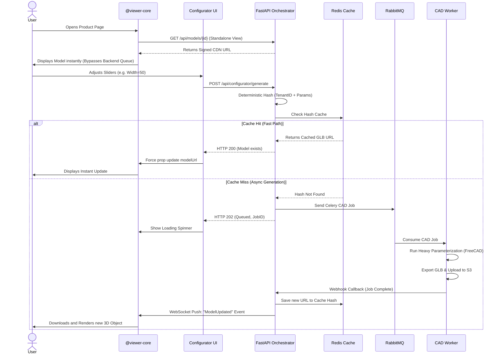

# 3D Configurator — Visual Architecture & Flow

*Prepared by Doc Agent Sigma for Product Owners and Customer Stakeholders.*

---

## 🏗️ High-Level System Architecture
This diagram outlines the microservices interacting across the stack. Notice the strict decoupling between the Frontend Viewer, the Configurator API, and the computationally heavy CAD workers.

```mermaid
graph TD
    subgraph Frontend [SaaS Portal UI]
        Viewer[@viewer-core Component]
        ConfigUI[Configurator Overlay]
    end

    subgraph CDN Edge [Asset Delivery Layer]
        CloudFront[AWS CloudFront]
        S3[(AWS S3 / Storage)]
        CloudFront --- S3
    end

    subgraph Backend [FastAPI Orchestrator]
        API[REST & WebSocket APIs]
        Redis[(Redis Cache & Quotas)]
        API <--> Redis
    end
    
    subgraph MessageBroker [Queue Layer]
        RabbitMQ([RabbitMQ / Celery Broker])
    end

    subgraph Compute [CAD Workers]
        PythonWorker[Python FreeCAD Celery]
        JavaWorker[Java Creo SpringBoot - Phase 3]
    end
    
    subgraph Data [PostgreSQL]
        DB[(DB RLS - Tenant Isolated)]
    end

    %% Flow connections
    Viewer -- 1. Request static .glb URL --> API
    API -- 2. Generate Signed URL --> Viewer
    Viewer -- 3. Fetch cached 3D model --> CloudFront
    
    ConfigUI -- 4. Pass Parametric Inputs --> API
    API -- 5. Push async Job to Queue --> RabbitMQ
    RabbitMQ -- 6. Consume Job --> PythonWorker
    PythonWorker -- 7. Upload new .glb --> S3
    PythonWorker -- 8. Notify completion callback --> API
    API -- 9. WebSocket push --> Viewer
    
    API <--> DB
```

---

## ⚡ Functional Flow Sequence
This sequence highlights the `O(1)` Cache Hit optimizations and the full asynchronous fallback loop when a CAD generation is actually required.



---

## 🧱 Building Blocks by Phase (Roadmap)

### Phase 1 (MVP) ➔ *Status: Nearing Completion*
The foundation slice that proves the core asynchronous loop works perfectly over local infrastructure.
- **Core Engine**: `@viewer-core` standalone canvas (React Three Fiber).
- **Backend API**: Python FastAPI REST & WebSockets.
- **Memory & Queuing**: Local Redis cache & RabbitMQ Celery dispatcher.
- **Compute Generation**: Python FreeCAD Worker.
- **Storage**: Local mounted `StaticFiles`.
- **Database Strategy**: PostgreSQL "Tenant Zero" (schema planted with `tenant_id` columns, but single-tenant logic).

### Phase 2 (SaaS Go-to-Market)
Activating the commercial limits to cleanly onboard multiple distinct businesses.
- **CDN Optimization**: Switch Storage Provider to AWS S3 + CloudFront. API returns Signed URLs.
- **Total Multi-Tenancy**: Activate PostgreSQL Row-Level Security (RLS). Database blocks cross-tenant reads entirely at the SQL layer.
- **Access Control**: NextAuth multi-tenant SSO.
- **Commercial Billing**: Redis Quota counters (O(1) checks) synced to persistent Postgres via Eventual Consistency CRON jobs.
- **Tenant Control Panel**: Drag-and-drop Visual Schema Builder.

### Phase 3 (Enterprise & Scale)
Bridging the cloud configurator into proprietary industrial enterprise engineering divisions.
- **Enterprise Engine Routing**: Orchestrator dynamically routes to varying CAD queues depending on client tier (`freecad` vs `ptc-creo`).
- **Heavy Compute Integration**: Java/Spring Boot proxy microservice seamlessly interacting with internal PTC Creo desktop instances.
- **Cost Scaling**: Automated S3 Glacier lifecycle rules for cold-storing inactive, free-tier tenant generated models.
